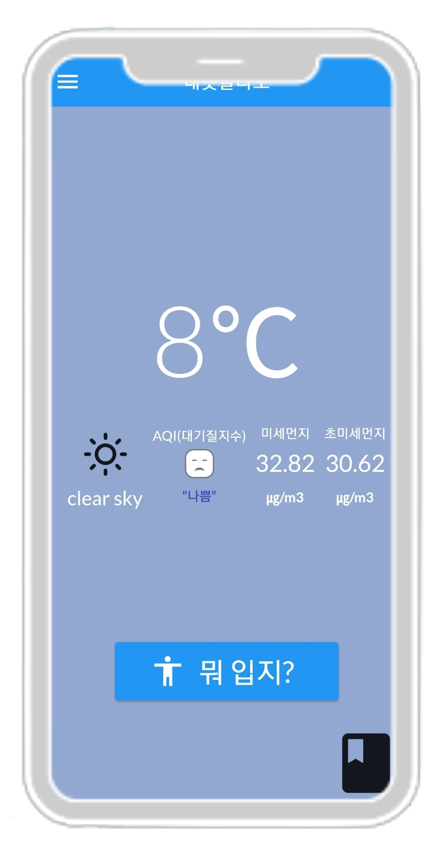

[](https://classroom.github.com/online_ide?assignment_repo_id=7010162&assignment_repo_type=AssignmentRepo)


# 내옷골라도🏝
### 1. 프로젝트 소개


> 누구든지 학교나 여행, 출근 등 외출을 했을 때 입고 나온 옷이 춥거나, 더웠던 경험이 한번 쯤은 있습니다.  
본 프로젝트는 날씨에 따른 옷차림을 추천해주는 앱으로 위와 같은 상황을 겪는 것을 줄이고자 합니다.  
날씨와 온도를 받아와서 그 온도에 따라 옷차림을 추천받을 수 있으며,  
추천 받은 옷차림의 춥거나 더운 정도를 메모할 수 있는 기능도 있습니다.


### 2. 소개 영상
추가예정

### 3. User Flow Daigram


### 4. 앱 컨셉

> 앙뚜아 24세 머시기
> 대충 지구를 지배하러 왔다는 뜻

### 5. 기능 예상 시안 및 설명


로그인이 가능 합니다.
사용자가 원하는 이메일과 비밀번호로 회원가입을 할 수 있으며, 회원가입 후 서버에 계정이 업로드 되고, 그 정보를 바탕으로 로그인을 할 수 있습니다.



메인 화면에서는 기본적인 날씨 정보를 제공합니다. 사용자의 위치에 맞는 실시간 날씨 정보를 제공하며,
대기질지수, 미세먼지에 대한 정보도 함께 제공됩니다. 앱 화면의 버튼을 누르면 현재 날씨에 맞는 옷차림을 추천 받는 화면으로 넘어가게
됩니다.


추천 데이터에 대한 피드백 기능을 제공합니다. 짧은 글을 작성하거나, 하단의 ‘반
응＇버튼을 입력하여 오늘 추천 받은 착장에 대한 나의 체감 피드백을 기록할 수 있습니다. 추후 같은 추천 데이터와 비슷한 기온
일 때, 과거에 내가 작성했던 피드백을 제공받을 수 있습니다.


과거에 작성한 피드백을 한 번에 모아 볼 수 있습니다. 내가 직접 느낀 날씨에 대한
기록을 확인함으로써 자신에게 가장 적합한 옷을 고르는 데 추가적인 도움을 받을 수 있습니다.


여러 사용자의 피드백을 서버에 업로드하여 공유하는 기능을 제공할 예정입니다. 동일한 추천 데이터를 받은 사용자
의 피드백을 볼 수 있으며, 사용자 정보를 선택하여 나와 같은 성향을 가진 사용자의 피드백만 모아 볼 수도 있습니다.


### 5. 보고서
중간고사 보고서 : [Link 클릭](https://github.com/kookmin-sw/capstone-2022-09/blob/master/docs/%EC%A4%91%EA%B0%84/%ED%8C%8009-%EC%A4%91%EA%B0%84%EB%B3%B4%EA%B3%A0%EC%84%9C.pdf)

### 4. 사용법 (아직 사용 불가)

```markdown
git clone https://github.com/kookmin-sw/capstone-2022-09.git
```


### 3. 팀 소개
### 이성진🐰
```markdown
🎓 ****1658 
✉️ leesjin@kookmin.ac.kr 
💟 front/back
```
### 이아영🐰
```markdown
🎓****1665
✉️ ayoung55@kookmin.ac.kr 
💟 UI/UX design
```

### 이예진🐰
```markdown
🎓****1668
✉️ chlonia@kookmin.ac.kr
💟 front/back
```

### 이정현🐰
```markdown
🎓****1672
✉️ dlwjdgus0918@kookmin.ac.kr
💟 front/back
```

## Markdown을 사용하여 내용꾸미기

Markdown은 작문을 스타일링하기위한 가볍고 사용하기 쉬운 구문입니다. 여기에는 다음을위한 규칙이 포함됩니다.

```markdown
Syntax highlighted code block

# Header 1
## Header 2
### Header 3

- Bulleted
- List

1. Numbered
2. List

**Bold** and _Italic_ and `Code` text

[Link](url) and 
```