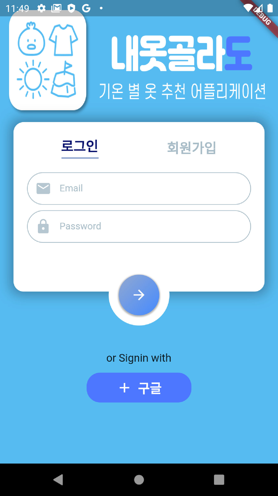
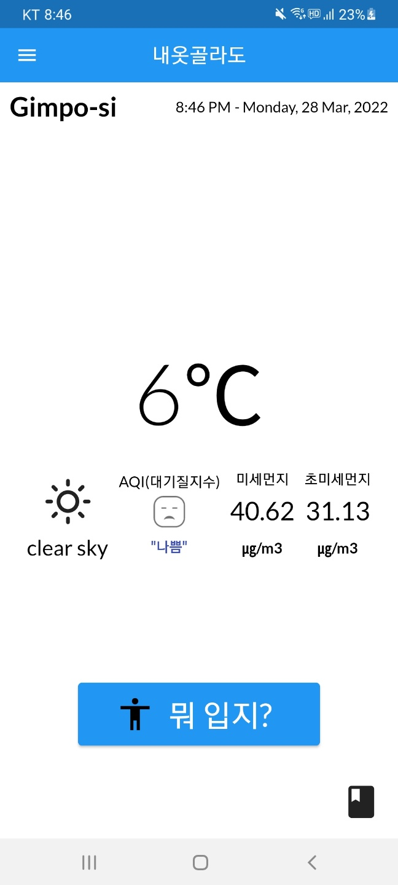
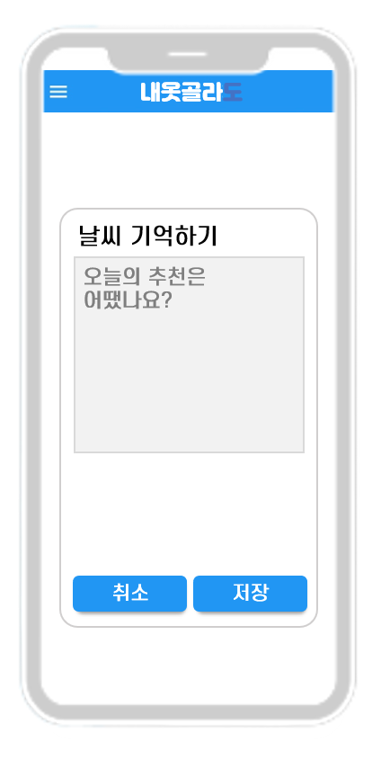
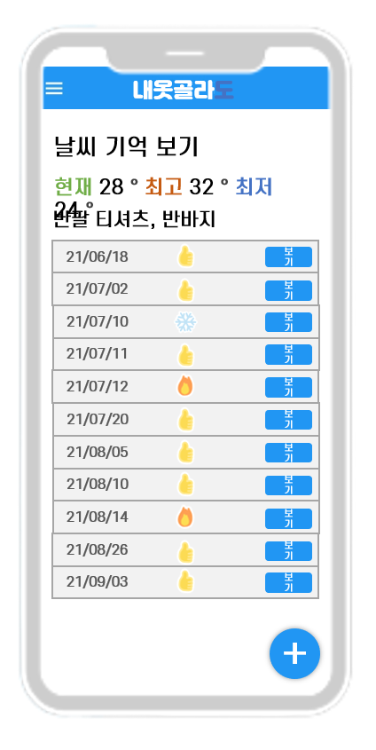
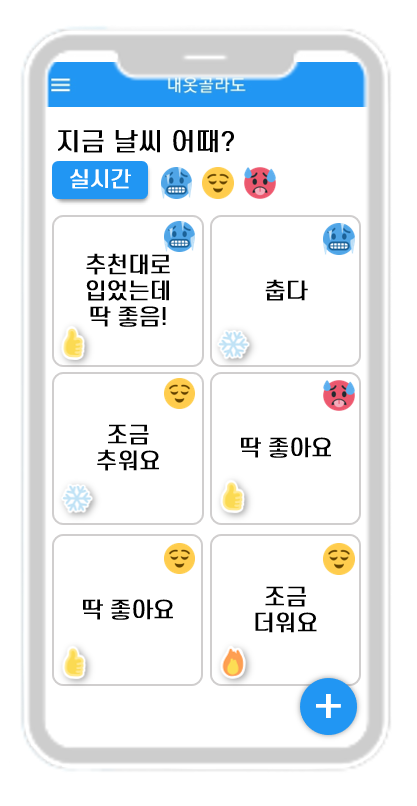

[](https://classroom.github.com/online_ide?assignment_repo_id=7010162&assignment_repo_type=AssignmentRepo)

**팀 페이지**: [https://kookmin-sw.github.io/capstone-2022-09/](https://kookmin-sw.github.io/capstone-2022-09/)
# 내옷골라도🏝


1. [프로젝트 소개](#프로젝트-소개)
2. [User Flow Diagram](#User-Flow-Diagram)
3. [캐릭터 소개](#캐릭터-소개)
4. [기능 예상 시안 및 설명](#기능-예상-시안-및-설명)
5. [보고서](#보고서)
6. [사용법](#사용법-(아직-사용-불가))
7. [팀 소개](#팀-소개)
----

## 프로젝트 소개


> 누구든지 학교나 여행, 출근 등 외출을 했을 때 입고 나온 옷이 춥거나, 더웠던 경험이 한번 쯤은 있습니다.  
본 프로젝트는 날씨에 따른 옷차림을 추천해주는 앱으로 위와 같은 상황을 겪는 것을 줄이고자 합니다.  
날씨와 온도를 받아와서 그 온도에 따라 옷차림을 추천받을 수 있으며,  
추천 받은 옷차림의 춥거나 더운 정도를 메모할 수 있는 기능도 있습니다.

## User Flow Diagram


## 캐릭터 소개


> 앙또끄 24살 도리
> 
> 지구를 지배하러 왔다가 불시착한 오리. 내옷골라도에서 살고 있다.
> 닭도리탕을 싫어한다고 한다.
> 날씨를 어떻게 아는지는 일급비밀이라고 한다.

## 기능 예상 시안 및 설명
<p align="center"></p>
로그인이 가능 합니다.
사용자가 원하는 이메일과 비밀번호로 회원가입을 할 수 있으며, 회원가입 후 서버에 계정이 업로드 되고, 그 정보를 바탕으로 로그인을 할 수 있습니다.

<p align="center">

</p>
메인 화면에서는 기본적인 날씨 정보를 제공합니다. 사용자의 위치에 맞는 실시간 날씨 정보를 제공하며,
대기질지수, 미세먼지에 대한 정보도 함께 제공됩니다. 앱 화면의 버튼을 누르면 현재 날씨에 맞는 옷차림을 추천 받는 화면으로 넘어가게
됩니다.

<p align="center">

</p>
한국 에너지 공단에서 제공해주는 "기온에 따른 옷차림" 자료를 토대로 옷차림을 추천해줍니다.
옷차림에 대한 팁도 알려줍니다.
만약 내 휴대폰에 저장하고 싶거나, 다른 사람들에게 공유하고 싶다면 각각 해당되는 버튼을 눌러서 넘어가게 합니다.

<p align="center">

</p>
추천 데이터에 대한 피드백 기능을 제공합니다. 짧은 글을 작성하거나, 하단의 ‘반
응＇버튼을 입력하여 오늘 추천 받은 착장에 대한 나의 체감 피드백을 기록할 수 있습니다. 추후 같은 추천 데이터와 비슷한 기온
일 때, 과거에 내가 작성했던 피드백을 제공받을 수 있습니다.

<p align="center">

</p>
과거에 작성한 피드백을 한 번에 모아 볼 수 있습니다. 내가 직접 느낀 날씨에 대한
기록을 확인함으로써 자신에게 가장 적합한 옷을 고르는 데 추가적인 도움을 받을 수 있습니다.

<p align="center">

</p>
여러 사용자의 피드백을 서버에 업로드하여 공유하는 기능을 제공할 예정입니다. 동일한 추천 데이터를 받은 사용자
의 피드백을 볼 수 있으며, 사용자 정보를 선택하여 나와 같은 성향을 가진 사용자의 피드백만 모아 볼 수도 있습니다.


## 보고서
중간고사 보고서 : [Link 클릭](https://github.com/kookmin-sw/capstone-2022-09/blob/master/docs/%EC%A4%91%EA%B0%84/%ED%8C%8009-%EC%A4%91%EA%B0%84%EB%B3%B4%EA%B3%A0%EC%84%9C.pdf)

## 사용법 (아직 사용 불가)

```markdown
git clone https://github.com/kookmin-sw/capstone-2022-09.git
```


## 팀 소개
### 이성진🐰
```markdown
🎓 ****1658
✉️ leesjin@kookmin.ac.kr
💟 #팀장 #앱개발(로그인,메모기능), #Firebase_관리
```
### 이아영🐰
```markdown
🎓****1665
✉️ ayoung55@kookmin.ac.kr
💟 #UI/UX_design #앱기획 #디자인
```

### 이예진🐰
```markdown
🎓****1668
✉️ chlonia@kookmin.ac.kr
💟 #앱개발(착장추천,메모기능) #GitHub관리
```

### 이정현🐰
```markdown
🎓****1672
✉️ dlwjdgus0918@kookmin.ac.kr
💟 #앱개발(날씨정보제공,메모기능) #Firebase_관리
```
