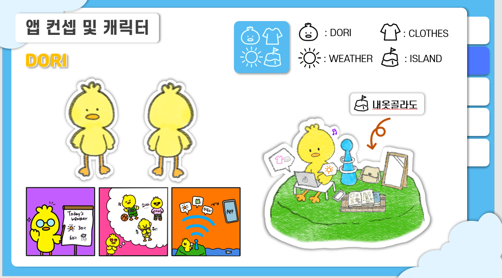

# 제목 없음


**팀 페이지**: [https://kookmin-sw.github.io/capstone-2022-09/](https://kookmin-sw.github.io/capstone-2022-09/)

# 내옷골라도🏝
1. [프로젝트 소개] (#프로젝트-소개)
2. [Abstract] (#Abstract)
3. [캐릭터 소개] (#캐릭터-소개)
4. [소개 영상] (#소개-영상)
5. [주요 기능 소개](#주요-기능-소개)
6. [기대효과](#기대효과)
7. [시스템 구성도](#시스템-구성도)
8. [사용 방법](#사용-방법)
9. [보고서](#보고서)
10. [팀 소개](#팀-소개)


---

## 프로젝트 소개


> 날씨에 맞는 옷차림을 추천 받고, 내가 느낀 그 날의 날씨와 옷차림을 기록하고 공유할 수 있는 기록형 날씨 앱
> 

누구든지 학교나 여행, 출근 등 외출을 했을 때 입고 나온 옷이 춥거나, 더웠던 경험이 한번 쯤은 있습니다.
본 프로젝트는 날씨에 따른 옷차림을 추천해주는 앱으로 위와 같은 상황을 겪는 것을 줄이고자 합니다.
날씨와 온도를 받아와서 그 온도에 따라 옷차림을 추천받을 수 있으며,
추천 받은 옷차림의 춥거나 더운 정도를 메모할 수 있는 기능도 있습니다.

## Abstract

> A record-type weather app that allows you to receive recommendations for clothes that fit the weather, record and share the weather and clothes that you felt that day
> 

Anyone has at least once experienced cold or hot clothes worn when they went out to school, travel, or work. This project is an app that recommends clothes according to the weather and aims to reduce the above situation. You can get recommendations for clothes according to the weather and temperature. There is also a function to note the cold or hot level of the recommended clothes.

## 캐릭터 소개



> 앙또끄 24살 도리
> 
> 
> 지구를 지배하러 왔다가 불시착한 오리. 내옷골라도에서 살고 있다.
> 닭도리탕을 싫어한다고 한다.
> 날씨를 어떻게 아는지는 일급비밀이라고 한다.
> 

## 소개 영상

[https://www.youtube.com/watch?v=D2KrQiwQthc&feature=emb_title](https://www.youtube.com/watch?v=D2KrQiwQthc&feature=emb_title)

## 주요 기능 소개


날씨 정보 제공 : 사용자의 위치를 기반으로 하여 기온, 강수, 바람, 미세먼지 등 날씨 정보 제공


옷차림 추천 : 현재 날씨 정보를 기반으로 한 옷차림 추천 데이터 제공


메모 작성 & 공유 : 개인 메모 작성으로 날씨와 옷차림 정보 기록, 공유 메모 기능으로 메모 공유 가능

## 기대효과


## 시스템 구성도


## 사용 방법

1. apk 파일 다운
    
    [https://drive.google.com/file/d/1uL5M6tai-FFCM89S18sGyZVGrXEz0ABP/view?usp=sharing](https://drive.google.com/file/d/1uL5M6tai-FFCM89S18sGyZVGrXEz0ABP/view?usp=sharing)
    
    들어가서 apk 파일 설치
    
2. 직접 실행
    1. [https://flutter-ko.dev/docs/get-started/install](https://flutter-ko.dev/docs/get-started/install) 
        
        링크를 참고해서 flutter를 설치 및 개발 환경 설정을 한다.
        
    2. 코드를 가져온다.
        
        ```
        git clone https://github.com/kookmin-sw/capstone-2022-09.git
        ```
        
    3. 프로젝트 경로로 이동
        
        ```
        cd capsone-2022-09/Neohtgollajo
        ```
        
    4. 필요한 패키지를 가져온다.
        
        ```
        flutter pub get
        ```
        
    5. flutter 프로젝트를 실행한다.
        
        ```
        flutter run
        ```
        

## 보고서

중간 보고서 : [Link 클릭](https://github.com/kookmin-sw/capstone-2022-09/blob/master/docs/%EC%A4%91%EA%B0%84/%ED%8C%8009-%EC%A4%91%EA%B0%84%EB%B3%B4%EA%B3%A0%EC%84%9C.pdf)

최종 보고서 : 

## 팀 소개

### 이성진🐰

```
🎓 ****1658
✉️ leesjin@kookmin.ac.kr
💟 #팀장 #앱개발(로그인,메모기능), #Firebase_관리

```

### 이아영🐰

```
🎓****1665
✉️ ayoung55@kookmin.ac.kr
💟 #UI/UX_design #앱기획 #디자인

```

### 이예진🐰

```
🎓****1668
✉️ chlonia@kookmin.ac.kr
💟 #앱개발(착장추천,메모기능) #GitHub관리

```

### 이정현🐰

```
🎓****1672
✉️ dlwjdgus0918@kookmin.ac.kr
💟 #앱개발(날씨정보제공,메모기능) #Firebase_관리

```
